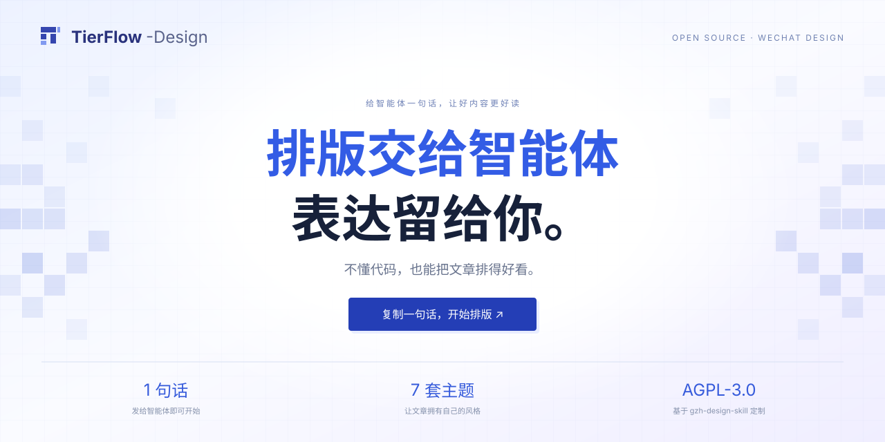

<div align="center">

<a href="https://mayanbiao1234.github.io/TierFlow-Design/"></a>

# TierFlow-Design

**From Markdown to a better reading experience on WeChat.**

[Live website](https://mayanbiao1234.github.io/TierFlow-Design/) · [Seven-theme gallery](https://mayanbiao1234.github.io/TierFlow-Design/#themes) · [中文](README.md) · [AGPL-3.0](LICENSE)

</div>

An AI Agent skill that assembles WeChat article HTML from theme component libraries. It provides section numbering, keyword emphasis, quotes, code blocks, images, validation scripts, and a preview wrapper with a rich-text copy button.

This is a customized derivative of [isjiamu/gzh-design-skill](https://github.com/isjiamu/gzh-design-skill), originally created by **Jiamu × Moyu Xiaoli**. Upstream attribution, Git history, and the AGPL-3.0 license are preserved.

## Get started — no coding required

Send this single message to an Agent that can install skills, read files and run tools, then attach your article:

```text
Please install and use the WeChat formatting skill from https://github.com/mayanbiao1234/TierFlow-Design to format the article I send next; choose a suitable theme, preserve the text and images, validate the output, and give me a preview page with a “Copy to WeChat” button.
```

Copy the message, send it with your article, then open the generated preview and paste the result into WeChat. After setup, just ask: “Use TierFlow-Design to format this article for WeChat.”

<details>
<summary>Prefer the terminal? Manual installation</summary>

Requires a Skills-compatible Agent, Node.js for installation, and Python 3 for checks:

```bash
npx skills add mayanbiao1234/TierFlow-Design
```

The skill identifier is `tierflow-design`. Manual setup can also clone this repository into a skill location supported by the Agent, keeping the relative paths of `SKILL.md`, `references/`, `scripts/`, and `assets/`.

</details>

The website previews themes; your chosen Agent processes the article. A text-only chatbot may need additional tools. This site has no article-upload endpoint.

## Seven curated themes

| Theme | Best for |
|---|---|
| Moyu Green (default) | Tutorials, lists, tool roundups |
| Red & White | Opinions and in-depth analysis |
| Graphite Minimal | Design and technology commentary |
| Zen Whitespace | Reflective essays and lifestyle |
| Moyu Ticket | Creative reviews and comparisons |
| Olive Journal | Editorial notes and case studies |
| Elegant White (added in this edition) | Analysis and data reviews, with serif headings and champagne-gold accents |

The [theme index](references/theme-index.md) defines each theme. A [theme generator](references/theme-generator.md) can create reusable libraries from a description or reference image.

## Additions in this edition

- Elegant White: the seventh theme, with serif headings and three-rule tables.
- `fix_quotes.py`: paired-quote conversion with content-preservation and control-character checks.
- Refined Moyu Green assembly: centered cover, no table of contents, no horizontal body margin.
- Written delivery rules: save transformations as scripts, verify preserved content, and read actual sentences during review.
- A responsive project website with seven theme previews, viewport controls, and copyable install instructions.

Existing gallery samples preserve upstream article layouts; newly generated articles follow the current theme recipes. Inline styles reduce formatting loss, but check the pasted result in WeChat before publishing.

## Preview and validate

The website has no frontend build dependencies:

```bash
python -m http.server 4173 --directory docs
python scripts/component_lint.py .
python scripts/check_project.py
python scripts/validate_gzh_html.py your-article.html
python scripts/wrap_preview.py your-article.html
```

Open `http://localhost:4173`. The component check must have zero errors; inherited dashed-border components currently produce advisory warnings. Check generated articles separately for punctuation and content completeness.

## Contributing and license

See [CONTRIBUTING.md](CONTRIBUTING.md), [deployment instructions](docs/deployment.md), and [CHANGELOG.md](CHANGELOG.md). Do not include credentials, private drafts, or personal information in contributions.

Original project: **Jiamu × Moyu Xiaoli**. This edition retains **GNU AGPL-3.0**. See [LICENSE](LICENSE) for full terms and [NOTICE](NOTICE) for attribution.
